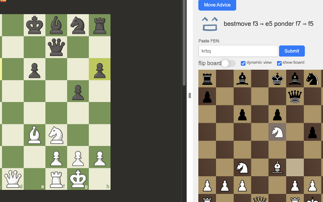
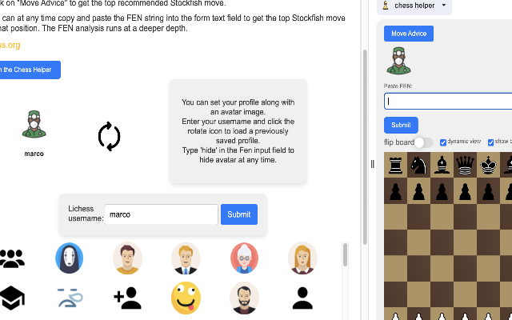
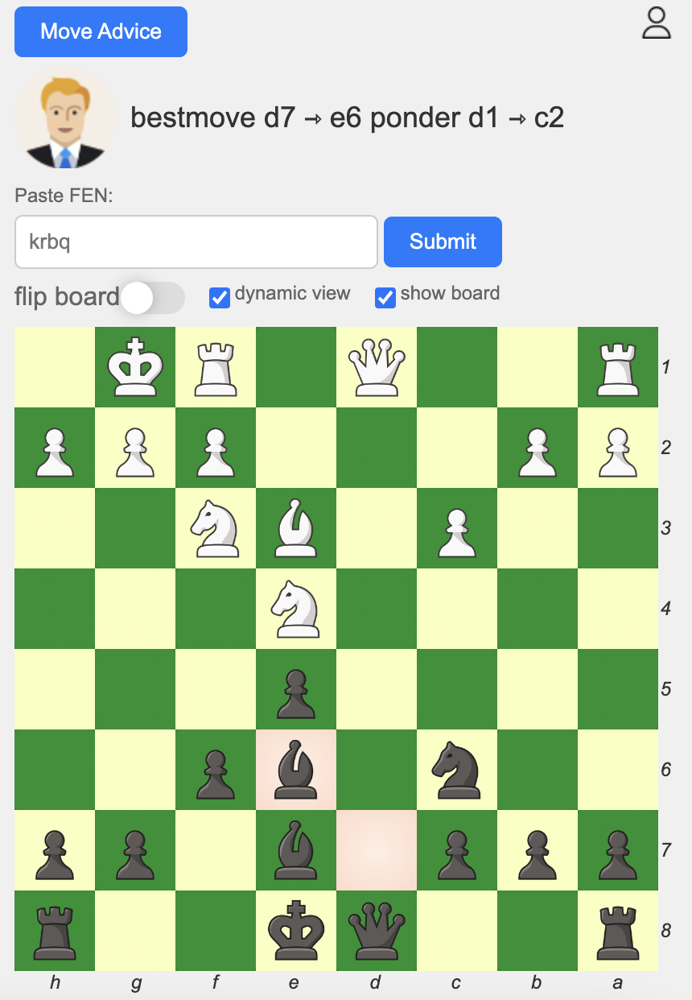

## Instructions

```bash
git clone <directory>
```

watch this video on how to load a chrome extension from your file system.
[video link](https://www.youtube.com/watch?v=oswjtLwCUqg)

Load the src folder.

## Using this extension

This program gives top stockfish move advice on any actively playing game
on chess.com and lichess.org.
Click the "Move Advice" button to get a great hint.

## Bonus

- UI that shows the board, with the ability to rotate the board.
- Chess.com or Lichess theme board, your choice.
- FEN position analyzer. Copy and paste your FEN string at any time!
- Avatar Selector. If you want an avatar, enter your username and select from
  the list, and your setting is saved.
- Click the "Blitz" clock to get a 50% faster server response.
- Runs on stockfish version 14.

## From the chrome store

This extension is available on the normal chrome store, but the chrome
store version does not include chess.com usage.
[chrome store link](https://chromewebstore.google.com/detail/chess-helper/gcgjgjnjjgbdepbhdecjnjmcfhlalghn)
<br/>



